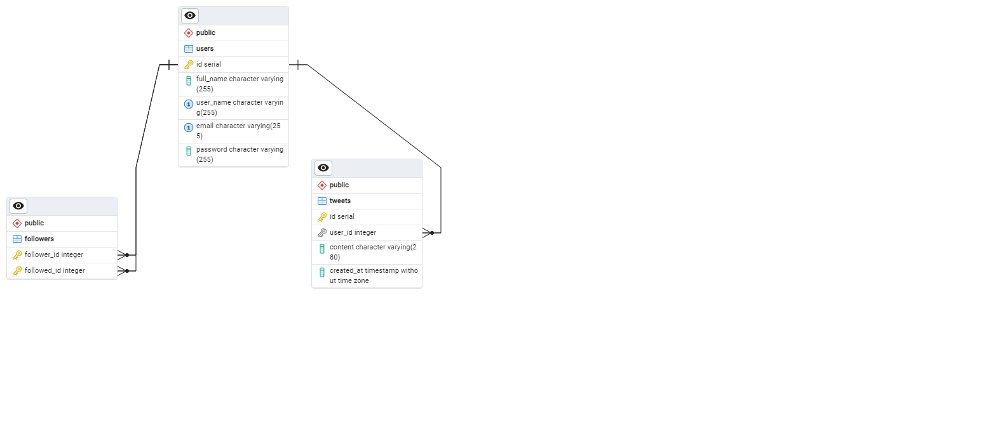

# mcs.tweet
Microservicio que maneja el flujo para crear , login , seguir, listar tweets y demas.


# Tecnologias utilizadas
Lenguaje: ```Java```

Framework: ```Spring```

Base datos: ```PostgreSql```

Seguridad:  ```Posee su API la cual valia el API KEY y ACCESS TOKEN```

Docker: ```Docker file para crear imagen ```

Documentacion:```Swagger-ui para documentar los enpoint ```

# Estructura de las tablas 


# Pasos para poder desplegar localmente

1- Clonar el proyecto

2- installar jdk 11 o jre

3- installar maven

4- compilar con el comando mvn clean install

5- ejecutar el comando java -jar mcs.tweet-0.0.1-SNAPSHOT.jar


# SCRIPT SQL
AL clonar el proyecto usted encontrara el archivo tweet.sql donde es la estructura esperada por el microservicio
