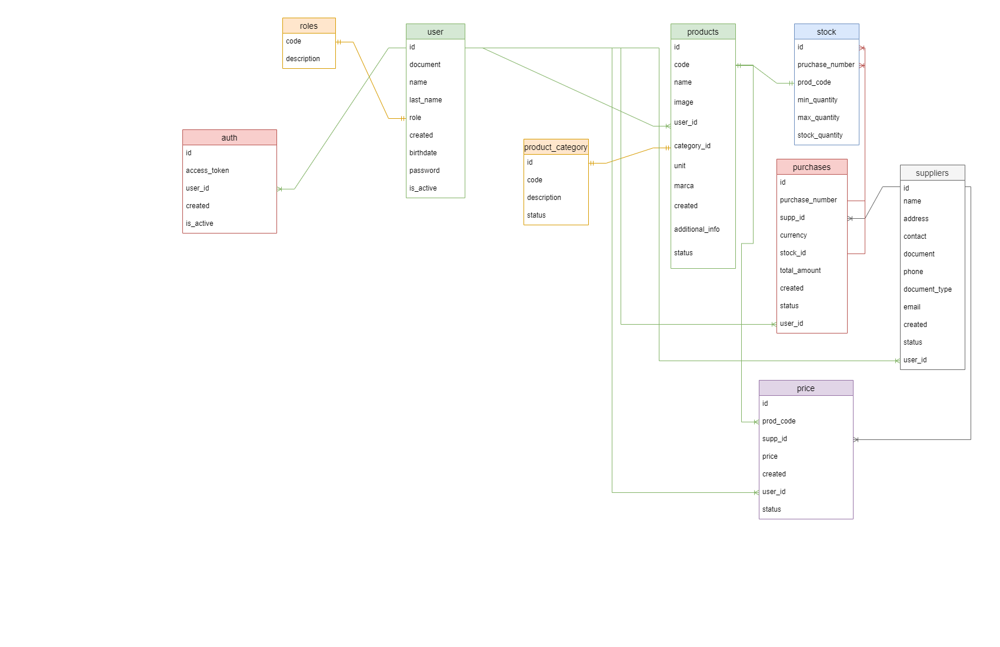

# mcs.kytech
Microservicio del sistema de ventas Kytech.


# Tecnologias utilizadas
Lenguaje: ```Java```

Framework: ```Spring```

Base datos: ```PostgreSql```

Seguridad:  ```Posee su API la cual valia el API KEY y ACCESS TOKEN```

Docker: ```Docker file para crear imagen ```

Documentacion:```Swagger-ui para documentar los enpoint ```

# Estructura de las tablas 


# Flujo con los mcs y apis relacionados
